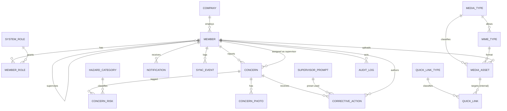

# Me Mataara / NQR — Database Design (v2, clean)

> **Status:** design (step 1 — "1st db design"). This is the target schema to migrate the
> backend onto. Nothing is dropped until it's approved. Engine: **PostgreSQL**.
> Modelled in Prisma; the SQL column/table names are clean `snake_case`.

This design turns the prototype's flat, array-in-column model into a **normalised, master +
linking** schema with **one universal convention applied to every table**: visibility flags,
soft delete, and a full audit trail.

---

## 1. Principles

1. **Every table is a citizen of the same system** — same id strategy, same flags, same audit
   columns, same soft-delete rule. No exceptions. You learn the convention once and it holds
   everywhere.
2. **Master tables for anything you'd manage** (categories, media types, link types, roles) —
   never free-typed strings for controlled values.
3. **Linking tables for every many-to-many** — no comma lists, no string arrays.
4. **Nothing is ever hard-deleted** — `is_deleted` + `deleted_at/by`. Data is recoverable and
   auditable.
5. **Everything is auditable** — who/when on every row, plus a field-level `audit_log` that
   records the actual before/after of each change.
6. **Clean SQL** — `snake_case` tables and columns; Prisma models stay idiomatic and map down.

---

## 2. The universal convention (on EVERY table)

Every table carries this exact block. It is the backbone of instructions #9, #10, #11, #13.

| Column | Type | Default | Purpose | Instruction |
|---|---|---|---|---|
| `id` | text (cuid) | generated | Primary key | — |
| `is_active` | bool | `true` | **Show on / off** — hide without deleting | **#9** |
| `is_disabled` | bool | `false` | **Disabled** — present but not usable | **#10** |
| `is_deleted` | bool | `false` | **Soft delete** — never hard-deleted | **#11** |
| `created_at` | timestamptz | `now()` | Row created | **#13** |
| `created_by` | text (member id) | null | Who created it | **#13** |
| `updated_at` | timestamptz | auto | Last change | **#13** |
| `updated_by` | text (member id) | null | Who changed it | **#13** |
| `deleted_at` | timestamptz | null | When soft-deleted | **#11/#13** |
| `deleted_by` | text (member id) | null | Who soft-deleted | **#11/#13** |

**Read rule:** application reads always filter `is_deleted = false` (and usually `is_active =
true`). This is enforced centrally by a Prisma client extension so no route can forget it.

**Field-level audit (#13):** every insert/update/delete also writes one `audit_log` row capturing
the entity, the record id, the action, and a JSON diff of the changed fields (old → new) plus the
actor. Row columns tell you *who last touched it*; `audit_log` tells you *exactly what changed*.

---

## 3. Entity map (ERD)



---

## 4. Table catalogue

Grouped by role in the system. Every table also has the **universal columns** from §2 — only the
*distinctive* columns are listed here.

### 4.1 Master / reference tables (#1)
Controlled vocabularies, admin-managed.

| Table | Key columns | Purpose |
|---|---|---|
| `system_role` | `code` (worker/supervisor/company_owner/platform_owner), `name` | The roles a member can hold (#1 master) |
| `media_type` | `code` (doc/video/audio), `name`, `storage_folder` | How uploads are categorised **in storage** (#5) |
| `mime_type` | `code` (e.g. `video/mp4`), `extension` (mp4/mp3/pdf), `media_type_id` | Allowed upload formats — **mp3, mp4** live here (#4) |
| `quick_link_type` | `code` (docs/videos), `name` | Buckets for quick links (#6) |
| `hazard_category` | `label`, `maori_label`, `icon`, `data_url`, `tint`, `sort_order` | Risk catalogue; **image held as a data URL on the category** (#8) |
| `supervisor_prompt` | `label`, `sort_order` | Preset supervisor responses |
| `ako_korero` | `title`, `body`, `sort_order` | Cultural learning content |

### 4.2 Identity (#3, #7)
| Table | Key columns | Purpose |
|---|---|---|
| `company` | `nzbn` (unique), `name`, `sites`, `adoption` | NZBN business |
| `member` | `circle_id` (unique), `worker_id` (unique), `first_name`, `last_name`, `email`, `mobile`, `password_hash`, `dob`, `gender`, `industry`, `is_hsr`, `company_id`, `supervisor_id`, `crew`, `approval`, `verification_status` | Employee/user. **`circle_id` maps the user to Circle (#3)**; **`worker_id` is the worker identifier (#7)** |
| `member_role` | `member_id`, `role_id` | **Linking table** member ↔ system_role (#1) |

### 4.3 Content library & quick links (#4, #5, #6)
| Table | Key columns | Purpose |
|---|---|---|
| `media_asset` | `title`, `description`, `media_type_id`, `mime_type_id`, `storage_key`, `storage_url`, `original_filename`, `size_bytes`, `uploaded_by` | An admin-uploaded file. **≤ 100 MB** (`size_bytes` check), **mp3/mp4** via `mime_type`, stored under its `media_type` folder — doc/video/audio (#4, #5) |
| `quick_link` | `title`, `quick_link_type_id`, `media_id?`, `external_url?`, `sort_order` | A quick link, bucketed as **docs / videos** (#6); points at an internal `media_asset` or an external URL |

### 4.4 Core — the concern loop
| Table | Key columns | Purpose |
|---|---|---|
| `concern` | `ref` (unique), `client_id` (idempotency), `primary_category_id`, `description`, `status`, `scene_date`, `reported_by_id`, `reported_by_name`, `reported_anonymous`, `reported_at`, `supervisor_id`, `assigned_to`, `company_id`, `nzbn`, `closed_at_iso`, `time_to_close_hours`, `risk_reduction`, `offline`, `capture_status`, `captured_at`, `synced_at` | A raised concern |
| `concern_risk` | `concern_id`, `category_id`, `is_primary` | **Linking table** concern ↔ hazard_category — replaces the old `riskIds` array (#1) |
| `concern_photo` | `concern_id`, `data_url`, `sort_order` | Worker-captured risk photos (#8 data URL) |
| `corrective_action` | `concern_id`, `author_id`, `author_name`, `role`, `message`, `at`, `prompt_id`, `response_type` | A supervisor/admin response (preset or custom) |
| `notification` | `recipient_id`, `kind`, `title`, `body`, `concern_ref`, `read`, `at` | Per-recipient alert |
| `sync_event` | `member_id`, `result`, `count`, `message`, `at` | Offline-sync telemetry |

### 4.5 Audit (#13)
| Table | Key columns | Purpose |
|---|---|---|
| `audit_log` | `entity`, `entity_id`, `action` (insert/update/delete), `changes` (JSONB old→new), `actor_id`, `at` | **Field-level audit trail** across the whole system |

---

## 5. How each instruction is satisfied

| # | Instruction | Where in the design |
|---|---|---|
| 1 | Master table + linking table | Master tables in §4.1; linking tables `member_role`, `concern_risk` |
| 2 | DB backend | PostgreSQL, modelled in Prisma (§6) |
| 3 | employee user id → circle id | `member.circle_id` (unique) |
| 4 | admin uploads video (100 MB max) mp3/mp4 | `media_asset` + `mime_type` (mp3/mp4); `size_bytes` ≤ 100 MB check; upload guarded to admin |
| 5 | stored as doc / video / audio | `media_type` (+ `storage_folder`); each asset filed under its type |
| 6 | quick links as docs / videos | `quick_link` + `quick_link_type` |
| 7 | worker id | `member.worker_id` (unique) |
| 8 | data URL → category | `hazard_category.data_url`; also `concern_photo.data_url` |
| 9 | show on/off | `is_active` on every table |
| 10 | is disable | `is_disabled` on every table |
| 11 | is delete (every table) | `is_deleted` + `deleted_at/by` on every table; central soft-delete read filter |
| 12 | 1st db design | this document |
| 13 | field audit | audit columns on every table **and** the `audit_log` field-level trail |

---

## 6. Prisma schema (PostgreSQL)

> Every model includes the universal block from §2. Kept explicit (Prisma has no mixins) but
> grouped and commented so it reads cleanly.

```prisma
generator client {
  provider = "prisma-client-js"
}

datasource db {
  provider = "postgresql"
  url      = env("DATABASE_URL")
}

/// ─────────────────────────── enums (fixed technical states) ───────────────────────────
enum ConcernStatus {
  open
  in_progress
  closed
}

enum ResponseType {
  preset
  custom
}

enum CaptureStatus {
  captured
  queued
  synced
  failed
}

enum Approval {
  approved
  awaiting_approval
}

enum Gender {
  female
  male
  gender_diverse
  prefer_not
}

enum NotifKind {
  new_concern
  status
  reminder
  closed
}

enum SyncResult {
  success
  failure
}

enum AuditAction {
  insert
  update
  delete
}

/// ─────────────────────────── master / reference tables ───────────────────────────
model SystemRole {
  id    String @id @default(cuid())
  code  String @unique            // worker | supervisor | company_owner | platform_owner
  name  String
  members MemberRole[]
  isActive Boolean @default(true) @map("is_active")
  isDisabled Boolean @default(false) @map("is_disabled")
  isDeleted Boolean @default(false) @map("is_deleted")
  createdAt DateTime @default(now()) @map("created_at")
  createdBy String? @map("created_by")
  updatedAt DateTime @updatedAt @map("updated_at")
  updatedBy String? @map("updated_by")
  deletedAt DateTime? @map("deleted_at")
  deletedBy String? @map("deleted_by")
  @@map("system_role")
}

model MediaType {
  id            String @id @default(cuid())
  code          String @unique          // doc | video | audio
  name          String
  storageFolder String @map("storage_folder") // where files of this type are stored (#5)
  mimeTypes MimeType[]
  assets    MediaAsset[]
  isActive Boolean @default(true) @map("is_active")
  isDisabled Boolean @default(false) @map("is_disabled")
  isDeleted Boolean @default(false) @map("is_deleted")
  createdAt DateTime @default(now()) @map("created_at")
  createdBy String? @map("created_by")
  updatedAt DateTime @updatedAt @map("updated_at")
  updatedBy String? @map("updated_by")
  deletedAt DateTime? @map("deleted_at")
  deletedBy String? @map("deleted_by")
  @@map("media_type")
}

model MimeType {
  id          String @id @default(cuid())
  code        String @unique          // e.g. video/mp4, audio/mpeg, application/pdf
  extension   String                  // mp4 | mp3 | pdf ...
  mediaTypeId String @map("media_type_id")
  mediaType   MediaType @relation(fields: [mediaTypeId], references: [id])
  assets      MediaAsset[]
  isActive Boolean @default(true) @map("is_active")
  isDisabled Boolean @default(false) @map("is_disabled")
  isDeleted Boolean @default(false) @map("is_deleted")
  createdAt DateTime @default(now()) @map("created_at")
  createdBy String? @map("created_by")
  updatedAt DateTime @updatedAt @map("updated_at")
  updatedBy String? @map("updated_by")
  deletedAt DateTime? @map("deleted_at")
  deletedBy String? @map("deleted_by")
  @@map("mime_type")
}

model QuickLinkType {
  id    String @id @default(cuid())
  code  String @unique              // docs | videos
  name  String
  links QuickLink[]
  isActive Boolean @default(true) @map("is_active")
  isDisabled Boolean @default(false) @map("is_disabled")
  isDeleted Boolean @default(false) @map("is_deleted")
  createdAt DateTime @default(now()) @map("created_at")
  createdBy String? @map("created_by")
  updatedAt DateTime @updatedAt @map("updated_at")
  updatedBy String? @map("updated_by")
  deletedAt DateTime? @map("deleted_at")
  deletedBy String? @map("deleted_by")
  @@map("quick_link_type")
}

model HazardCategory {
  id          String  @id @default(cuid())
  label       String
  maoriLabel  String? @map("maori_label")
  icon        String  @default("")
  dataUrl     String  @default("") @map("data_url")   // category image as a data URL (#8)
  tint        String  @default("pounamu")
  description String  @default("")
  sortOrder   Int     @default(0) @map("sort_order")
  concernRisks ConcernRisk[]
  primaryFor   Concern[]     @relation("PrimaryCategory")
  isActive Boolean @default(true) @map("is_active")
  isDisabled Boolean @default(false) @map("is_disabled")
  isDeleted Boolean @default(false) @map("is_deleted")
  createdAt DateTime @default(now()) @map("created_at")
  createdBy String? @map("created_by")
  updatedAt DateTime @updatedAt @map("updated_at")
  updatedBy String? @map("updated_by")
  deletedAt DateTime? @map("deleted_at")
  deletedBy String? @map("deleted_by")
  @@map("hazard_category")
}

model SupervisorPrompt {
  id        String @id @default(cuid())
  label     String
  sortOrder Int    @default(0) @map("sort_order")
  actions   CorrectiveAction[]
  isActive Boolean @default(true) @map("is_active")
  isDisabled Boolean @default(false) @map("is_disabled")
  isDeleted Boolean @default(false) @map("is_deleted")
  createdAt DateTime @default(now()) @map("created_at")
  createdBy String? @map("created_by")
  updatedAt DateTime @updatedAt @map("updated_at")
  updatedBy String? @map("updated_by")
  deletedAt DateTime? @map("deleted_at")
  deletedBy String? @map("deleted_by")
  @@map("supervisor_prompt")
}

model AkoKorero {
  id        String @id @default(cuid())
  title     String
  body      String
  sortOrder Int    @default(0) @map("sort_order")
  isActive Boolean @default(true) @map("is_active")
  isDisabled Boolean @default(false) @map("is_disabled")
  isDeleted Boolean @default(false) @map("is_deleted")
  createdAt DateTime @default(now()) @map("created_at")
  createdBy String? @map("created_by")
  updatedAt DateTime @updatedAt @map("updated_at")
  updatedBy String? @map("updated_by")
  deletedAt DateTime? @map("deleted_at")
  deletedBy String? @map("deleted_by")
  @@map("ako_korero")
}

/// ─────────────────────────── identity ───────────────────────────
model Company {
  id       String @id @default(cuid())
  nzbn     String @unique
  name     String
  sites    Int    @default(1)
  adoption Int    @default(0)
  members  Member[]
  isActive Boolean @default(true) @map("is_active")
  isDisabled Boolean @default(false) @map("is_disabled")
  isDeleted Boolean @default(false) @map("is_deleted")
  createdAt DateTime @default(now()) @map("created_at")
  createdBy String? @map("created_by")
  updatedAt DateTime @updatedAt @map("updated_at")
  updatedBy String? @map("updated_by")
  deletedAt DateTime? @map("deleted_at")
  deletedBy String? @map("deleted_by")
  @@map("company")
}

model Member {
  id           String  @id @default(cuid())
  circleId     String? @unique @map("circle_id")  // maps user → Circle identity (#3)
  workerId     String? @unique @map("worker_id")  // worker identifier (#7)
  firstName    String  @map("first_name")
  lastName     String  @map("last_name")
  email        String  @unique
  mobile       String  @unique
  passwordHash String? @map("password_hash")
  dob          String?
  gender       Gender?
  industry     String?
  isHsr        Boolean @default(false) @map("is_hsr")
  companyId    String? @map("company_id")
  company      Company? @relation(fields: [companyId], references: [id], onDelete: SetNull)
  companyName  String? @map("company_name")
  nzbn         String?
  organisation String?
  supervisorId String? @map("supervisor_id")
  supervisor   Member?  @relation("Supervision", fields: [supervisorId], references: [id], onDelete: SetNull)
  crewMembers  Member[] @relation("Supervision")
  supervisorName String? @map("supervisor_name")
  crew         String?
  approval     Approval?
  initials     String?
  avatarColor  String? @map("avatar_color")
  verificationStatus String @default("verified") @map("verification_status")

  roles            MemberRole[]
  concernsReported Concern[]          @relation("Reporter")
  concernsAssigned Concern[]          @relation("Supervisor")
  actions          CorrectiveAction[]
  notifications    Notification[]
  syncEvents       SyncEvent[]
  uploads          MediaAsset[]

  isActive Boolean @default(true) @map("is_active")
  isDisabled Boolean @default(false) @map("is_disabled")
  isDeleted Boolean @default(false) @map("is_deleted")
  createdAt DateTime @default(now()) @map("created_at")
  createdBy String? @map("created_by")
  updatedAt DateTime @updatedAt @map("updated_at")
  updatedBy String? @map("updated_by")
  deletedAt DateTime? @map("deleted_at")
  deletedBy String? @map("deleted_by")
  @@map("member")
}

model MemberRole {
  id       String @id @default(cuid())
  memberId String @map("member_id")
  member   Member @relation(fields: [memberId], references: [id], onDelete: Cascade)
  roleId   String @map("role_id")
  role     SystemRole @relation(fields: [roleId], references: [id])
  isActive Boolean @default(true) @map("is_active")
  isDisabled Boolean @default(false) @map("is_disabled")
  isDeleted Boolean @default(false) @map("is_deleted")
  createdAt DateTime @default(now()) @map("created_at")
  createdBy String? @map("created_by")
  updatedAt DateTime @updatedAt @map("updated_at")
  updatedBy String? @map("updated_by")
  deletedAt DateTime? @map("deleted_at")
  deletedBy String? @map("deleted_by")
  @@unique([memberId, roleId])
  @@map("member_role")
}

/// ─────────────────────────── content library & quick links ───────────────────────────
model MediaAsset {
  id               String @id @default(cuid())
  title            String
  description      String @default("")
  mediaTypeId      String @map("media_type_id")
  mediaType        MediaType @relation(fields: [mediaTypeId], references: [id])
  mimeTypeId       String @map("mime_type_id")
  mimeType         MimeType @relation(fields: [mimeTypeId], references: [id])
  storageKey       String @map("storage_key")          // path within storage/<type>/
  storageUrl       String @map("storage_url")
  originalFilename String @map("original_filename")
  sizeBytes        Int    @map("size_bytes")           // ≤ 104857600 (100 MB) — checked (#4)
  uploadedById     String @map("uploaded_by")
  uploadedBy       Member @relation(fields: [uploadedById], references: [id])
  quickLinks       QuickLink[]
  isActive Boolean @default(true) @map("is_active")
  isDisabled Boolean @default(false) @map("is_disabled")
  isDeleted Boolean @default(false) @map("is_deleted")
  createdAt DateTime @default(now()) @map("created_at")
  createdBy String? @map("created_by")
  updatedAt DateTime @updatedAt @map("updated_at")
  updatedBy String? @map("updated_by")
  deletedAt DateTime? @map("deleted_at")
  deletedBy String? @map("deleted_by")
  @@map("media_asset")
}

model QuickLink {
  id          String @id @default(cuid())
  title       String
  typeId      String @map("quick_link_type_id")
  type        QuickLinkType @relation(fields: [typeId], references: [id])
  mediaId     String? @map("media_id")
  media       MediaAsset? @relation(fields: [mediaId], references: [id], onDelete: SetNull)
  externalUrl String? @map("external_url")
  sortOrder   Int @default(0) @map("sort_order")
  isActive Boolean @default(true) @map("is_active")
  isDisabled Boolean @default(false) @map("is_disabled")
  isDeleted Boolean @default(false) @map("is_deleted")
  createdAt DateTime @default(now()) @map("created_at")
  createdBy String? @map("created_by")
  updatedAt DateTime @updatedAt @map("updated_at")
  updatedBy String? @map("updated_by")
  deletedAt DateTime? @map("deleted_at")
  deletedBy String? @map("deleted_by")
  @@map("quick_link")
}

/// ─────────────────────────── core: the concern loop ───────────────────────────
model Concern {
  id                String @id @default(cuid())
  ref               String @unique
  clientId          String? @unique @map("client_id")
  primaryCategoryId String @map("primary_category_id")
  primaryCategory   HazardCategory @relation("PrimaryCategory", fields: [primaryCategoryId], references: [id])
  description       String @default("")
  status            ConcernStatus @default(open)
  sceneDate         String? @map("scene_date")

  reportedById      String @map("reported_by_id")
  reportedBy        Member @relation("Reporter", fields: [reportedById], references: [id])
  reportedByName    String @map("reported_by_name")
  reportedAnonymous Boolean @default(false) @map("reported_anonymous")
  reportedAt        DateTime @default(now()) @map("reported_at")

  supervisorId String? @map("supervisor_id")
  supervisor   Member? @relation("Supervisor", fields: [supervisorId], references: [id], onDelete: SetNull)
  assignedTo   String? @map("assigned_to")

  companyId String? @map("company_id")
  nzbn      String?

  closedAt         String?   @map("closed_at")
  closedAtIso      DateTime? @map("closed_at_iso")
  timeToCloseHours Float?    @map("time_to_close_hours")
  riskReduction    String?   @map("risk_reduction")

  offline       Boolean        @default(false)
  captureStatus CaptureStatus? @map("capture_status")
  capturedAt    DateTime?      @map("captured_at")
  syncedAt      DateTime?      @map("synced_at")

  risks   ConcernRisk[]
  photos  ConcernPhoto[]
  actions CorrectiveAction[]

  isActive Boolean @default(true) @map("is_active")
  isDisabled Boolean @default(false) @map("is_disabled")
  isDeleted Boolean @default(false) @map("is_deleted")
  createdAt DateTime @default(now()) @map("created_at")
  createdBy String? @map("created_by")
  updatedAt DateTime @updatedAt @map("updated_at")
  updatedBy String? @map("updated_by")
  deletedAt DateTime? @map("deleted_at")
  deletedBy String? @map("deleted_by")
  @@index([supervisorId])
  @@index([reportedById])
  @@index([status])
  @@map("concern")
}

model ConcernRisk {
  id         String @id @default(cuid())
  concernId  String @map("concern_id")
  concern    Concern @relation(fields: [concernId], references: [id], onDelete: Cascade)
  categoryId String @map("category_id")
  category   HazardCategory @relation(fields: [categoryId], references: [id])
  isPrimary  Boolean @default(false) @map("is_primary")
  isActive Boolean @default(true) @map("is_active")
  isDisabled Boolean @default(false) @map("is_disabled")
  isDeleted Boolean @default(false) @map("is_deleted")
  createdAt DateTime @default(now()) @map("created_at")
  createdBy String? @map("created_by")
  updatedAt DateTime @updatedAt @map("updated_at")
  updatedBy String? @map("updated_by")
  deletedAt DateTime? @map("deleted_at")
  deletedBy String? @map("deleted_by")
  @@unique([concernId, categoryId])
  @@map("concern_risk")
}

model ConcernPhoto {
  id        String @id @default(cuid())
  concernId String @map("concern_id")
  concern   Concern @relation(fields: [concernId], references: [id], onDelete: Cascade)
  dataUrl   String @map("data_url")   // worker-captured photo (#8)
  sortOrder Int @default(0) @map("sort_order")
  isActive Boolean @default(true) @map("is_active")
  isDisabled Boolean @default(false) @map("is_disabled")
  isDeleted Boolean @default(false) @map("is_deleted")
  createdAt DateTime @default(now()) @map("created_at")
  createdBy String? @map("created_by")
  updatedAt DateTime @updatedAt @map("updated_at")
  updatedBy String? @map("updated_by")
  deletedAt DateTime? @map("deleted_at")
  deletedBy String? @map("deleted_by")
  @@map("concern_photo")
}

model CorrectiveAction {
  id           String @id @default(cuid())
  concernId    String @map("concern_id")
  concern      Concern @relation(fields: [concernId], references: [id], onDelete: Cascade)
  authorId     String? @map("author_id")
  author       Member? @relation(fields: [authorId], references: [id], onDelete: SetNull)
  authorName   String @map("author_name")
  role         String                                 // app role snapshot
  message      String
  at           DateTime @default(now())
  promptId     String? @map("prompt_id")
  prompt       SupervisorPrompt? @relation(fields: [promptId], references: [id])
  responseType ResponseType @map("response_type")
  isActive Boolean @default(true) @map("is_active")
  isDisabled Boolean @default(false) @map("is_disabled")
  isDeleted Boolean @default(false) @map("is_deleted")
  createdAt DateTime @default(now()) @map("created_at")
  createdBy String? @map("created_by")
  updatedAt DateTime @updatedAt @map("updated_at")
  updatedBy String? @map("updated_by")
  deletedAt DateTime? @map("deleted_at")
  deletedBy String? @map("deleted_by")
  @@index([concernId])
  @@map("corrective_action")
}

model Notification {
  id          String @id @default(cuid())
  recipientId String? @map("recipient_id")
  recipient   Member? @relation(fields: [recipientId], references: [id], onDelete: SetNull)
  kind        NotifKind
  title       String
  body        String
  concernRef  String? @map("concern_ref")
  read        Boolean @default(false)
  at          DateTime @default(now())
  isActive Boolean @default(true) @map("is_active")
  isDisabled Boolean @default(false) @map("is_disabled")
  isDeleted Boolean @default(false) @map("is_deleted")
  createdAt DateTime @default(now()) @map("created_at")
  createdBy String? @map("created_by")
  updatedAt DateTime @updatedAt @map("updated_at")
  updatedBy String? @map("updated_by")
  deletedAt DateTime? @map("deleted_at")
  deletedBy String? @map("deleted_by")
  @@index([recipientId])
  @@map("notification")
}

model SyncEvent {
  id       String @id @default(cuid())
  memberId String? @map("member_id")
  member   Member? @relation(fields: [memberId], references: [id], onDelete: SetNull)
  result   SyncResult
  count    Int @default(0)
  message  String?
  at       DateTime @default(now())
  isActive Boolean @default(true) @map("is_active")
  isDisabled Boolean @default(false) @map("is_disabled")
  isDeleted Boolean @default(false) @map("is_deleted")
  createdAt DateTime @default(now()) @map("created_at")
  createdBy String? @map("created_by")
  updatedAt DateTime @updatedAt @map("updated_at")
  updatedBy String? @map("updated_by")
  deletedAt DateTime? @map("deleted_at")
  deletedBy String? @map("deleted_by")
  @@index([memberId])
  @@map("sync_event")
}

/// ─────────────────────────── field-level audit trail (#13) ───────────────────────────
model AuditLog {
  id       String @id @default(cuid())
  entity   String                         // table name
  entityId String @map("entity_id")
  action   AuditAction
  changes  Json?                          // { field: { old, new } }
  actorId  String? @map("actor_id")
  at       DateTime @default(now())
  @@index([entity, entityId])
  @@map("audit_log")
}
```

---

## 7. Notes on the tricky bits

- **100 MB limit (#4):** enforced two ways — the upload route rejects `> 104_857_600` bytes before
  writing, and the migration adds a Postgres `CHECK (size_bytes <= 104857600)` on `media_asset`
  (Prisma can't express check constraints, so it goes in the migration SQL).
- **mp3 / mp4 (#4):** `mime_type` seeds `audio/mpeg` (mp3) and `video/mp4` (mp4); the upload route
  validates the file's mime against the active `mime_type` set for the chosen `media_type`.
- **Storage layout (#5):** files land in `backend/storage/<media_type.storage_folder>/…` — i.e.
  `storage/doc/`, `storage/video/`, `storage/audio/`. `storage_key` is the relative path;
  `storage_url` is what the API serves.
- **Soft delete everywhere (#11):** a Prisma client extension rewrites `delete` → `update
  { is_deleted: true, deleted_at, deleted_by }` and adds `is_deleted = false` to every read, so
  individual routes stay clean and can't leak deleted rows.
- **Audit (#13):** the same extension writes an `audit_log` row on every create/update/delete with
  the JSON diff and the acting member — one place, no per-route boilerplate.
- **Frontend stays stable:** the API response shapes (`Concern`, `HazardCategory`, etc.) are
  unchanged — DTO mappers reassemble `riskIds[]`/`photos[]` from the linking/child tables and expose
  `data_url` as `image`. So the admin/supervisor wiring already built keeps working.

---

## 8. Migration plan (once approved)

1. Replace `backend/prisma/schema.prisma` with §6; add the `CHECK` constraint in the generated
   migration SQL.
2. Add the soft-delete + audit **Prisma client extension** (one file) and route all reads/writes
   through it.
3. Update DTO mappers so API responses are byte-for-byte the same for the frontend.
4. Rewrite `seed.ts` against the new tables (roles, media types, mime types, quick-link types,
   categories with `data_url`, members with `circle_id`/`worker_id`, sample concerns via
   `concern_risk`).
5. Add routes for the new resources: `media_asset` (admin upload, 100 MB, mp3/mp4) and `quick_link`.
6. `prisma migrate dev` → `db seed`; verify with `prisma validate` + `tsc` + endpoint checks.

No table is dropped or data lost before this is approved.

---

## 9. As-built notes (implemented)

The schema in `backend/prisma/schema.prisma` follows this design, with these pragmatic
implementation choices (all validated: `prisma validate` + `tsc` clean):

- **Roles:** `member` keeps `circle_role` + `role` (enums) as the **auth fast-path**, *and* the
  `system_role` master + `member_role` linking table are present and seeded. The enums drive
  authorization (unchanged, robust); `member_role` is the normalised record (#1).
- **Category image:** stored in the `data_url` column (#8); the Prisma field is named `image` so
  the frontend contract is unchanged (mapped at the route edge).
- **`active`:** the prototype's domain `active` on hazards/prompts is the universal `is_active`
  (#9) — the same "show on/off" concept — mapped to `active` in the API responses.
- **`error_log`** is retained (System status view) with the universal columns.
- **Soft delete + audit** live in `backend/src/prisma.ts` (a Prisma `$use` middleware): deletes
  become `is_deleted` updates, reads hide deleted rows, and every write appends an `audit_log`
  row (best-effort, non-blocking). `audit_log` itself is exempt.
- **Uploads:** `POST /media` (admin) accepts a file ≤ 100 MB, validates its mime against the
  `mime_type` master for the chosen `media_type` (mp3/mp4/pdf), stores it under
  `backend/storage/<doc|video|audio>/`, and records a `media_asset` row (#4, #5).
- **Migration:** run `npm run prisma:migrate` (backend) to create the tables. The `CHECK
  (size_bytes <= 104857600)` on `media_asset` is added in the migration SQL; the route also
  enforces the 100 MB limit up front.
